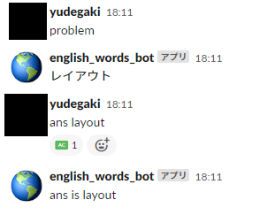
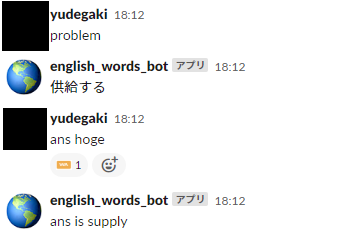

# English Words BOT for Slack

## Requirement
```
slackbot==1.0.0
```


## Command List
### Question
```
problem
```
after this command, the question will be asked. 

### Answer
```
ans [word]
```
ex) To answer "hoge"
```
ans hoge
```

### Judge

#### Correct Answer


#### Wrong Answer



## Word list

I use [NGSL/NAWL](http://www.newgeneralservicelist.org/new-ngsl-japanese-defs) as a list of words  
Browne, C., Culligan, B. & Phillips, J. (2013). The New General Service List. Retrieved from    http://www.newgeneralservicelist.org.  


